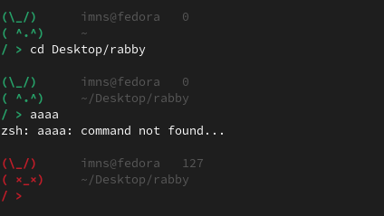

# RABBY ZSH THEME



Rabby is a fun and visually appealing ZSH theme featuring an ASCII art rabbit that appears to hold your commands. It adds a playful touch to your terminal while maintaining a clean and functional design. Perfect for those who want a unique and enjoyable terminal experience!

### Installation
1. Clone the repository:
    ```bash
    git clone https://github.com/enesbaytekin/rabby.git
    ```
2. Use the provided scripts to enable or disable the theme:

- To enable the theme, run:
   ```bash
   ./use_theme.sh
   ```

- To disable and turn back to your old theme, run:
   ```bash
   ./dont_use_theme.sh
   ```

Enjoy your new terminal companion!
